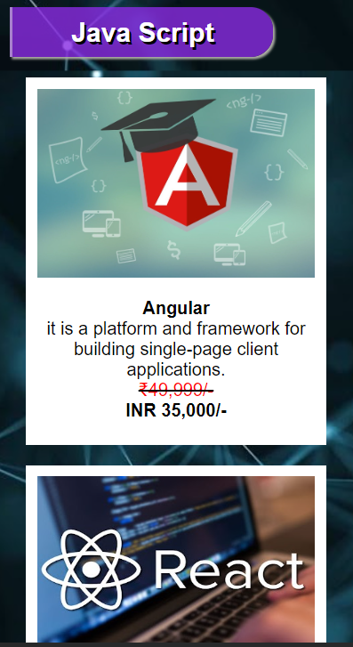
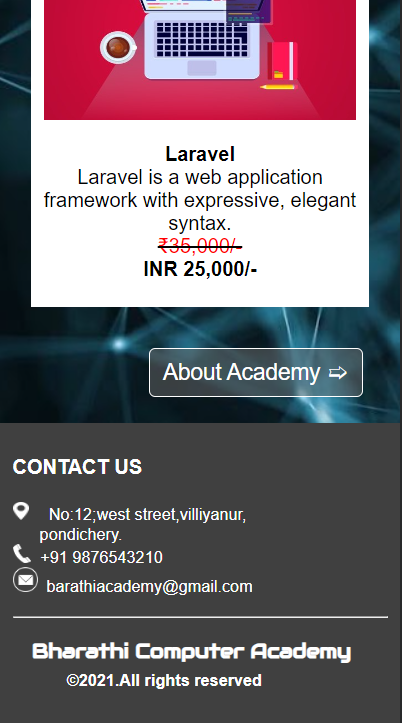
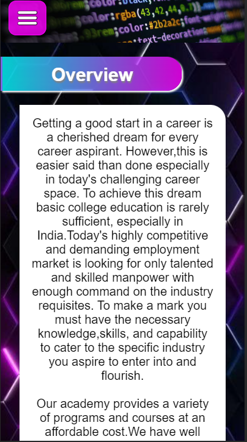
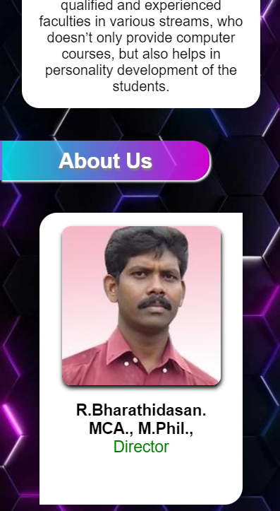
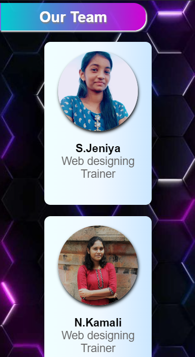
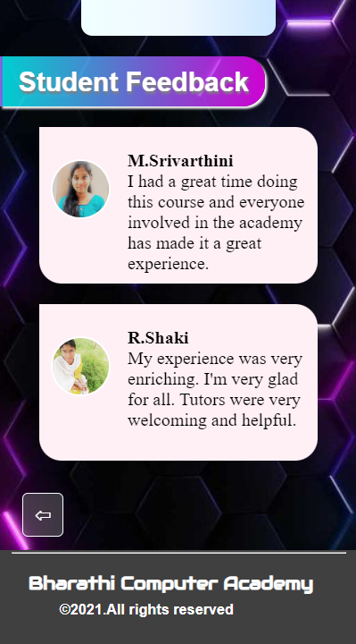

# Bharathi Computer Academy Mobile Website

Welcome! This project was initially developed in 2021 as part of my college coursework, serving as my first web development assignment. While the design may reflect a more like a old style, it holds sentimental value as a starting point in my journey as a web developer.

## Project Overview:

Bharathi Computer Academy Mobile Website is a simple web application consisting of two pages:

### 1. Faculties and Courses Page:
- Provides information about the academy's faculties.
- Displays the various courses offered.

### 2. Academy Overview, Team, and Feedback Page:
- Offers an overview of Bharathi Computer Academy.
- Introduces the team members.
- Showcases student feedback.

## Technologies Used:

This project was built using the following technologies:
- HTML
- CSS

## Screenshots:

### Faculties and Courses Page:

### Academy Overview Page:

## Reflection:

This project serves as a time capsule, reflecting my skills and understanding of web development in 2021. As I revisit this project, I realize how far I've come in terms of design, coding practices, and overall development proficiency. The simplicity of the design and structure reminds me of the early stages of my coding journey.

---

**Disclaimer:** This project is a representation of my skills and knowledge at the time of its creation and may not reflect my current proficiency in web development.

